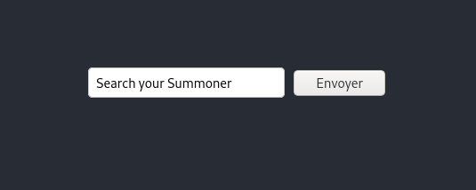
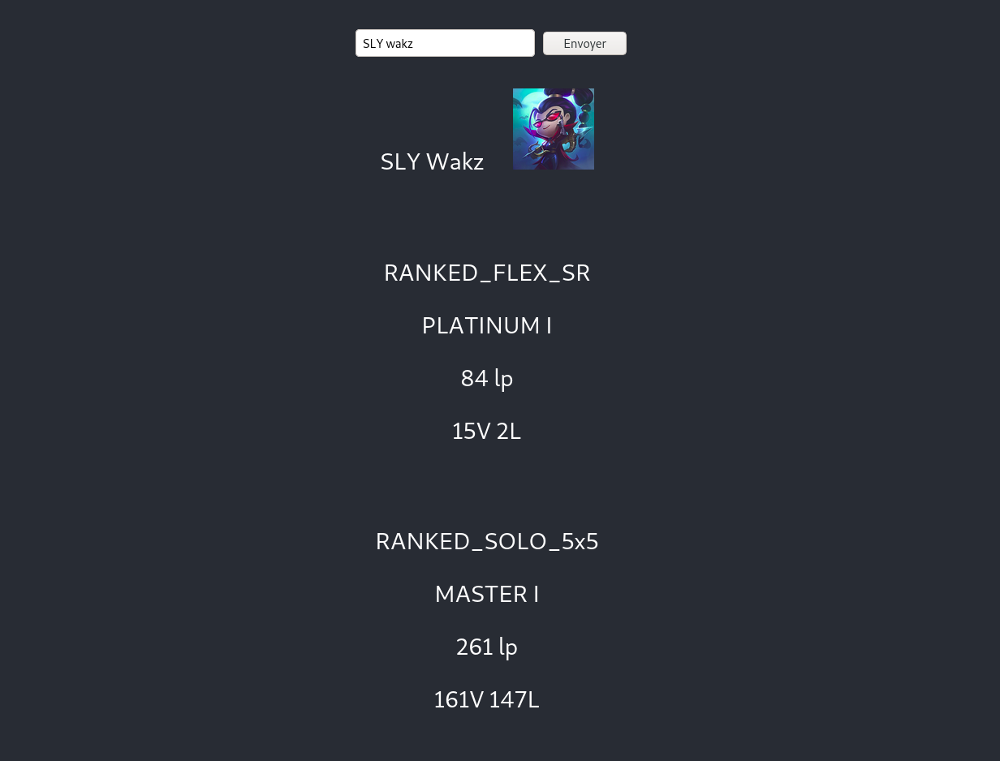

# lol_api_react
A React.js Website, using League Of Legends API

This is my First React.js project, and my first time using APIs
In this project, I'm using Riot Games's API, to get datas from League of Legends players.
(The website is not currently beautiful, I don't know if i'll do some front)

**REQUIREMENTS :** React.js   yarn   npm    Riot Games API key

**HOW TO GET A RIOT GAMES API :** go to `https://developer.riotgames.com/` either click on *SIGN UP NOW* or *LOGIN* (depends if you already have a RIOT GAMES account.

The page should be like that :

If your key has expired, regenerate one.

**START THE PROJECT**

open the repository inside your shell, type `cd lol_api_react/`, then copy your <strong>API key</strong> and paste it inside `config.js` file.
Now type `yarn start` in the shell, and open the website inside your browser

You should have something close to this :                                  

You can now search your summoner (⚠️ Currently only work for EUW region ⚠️)

If your player is found you should have something close to this : 

If you have any questions, feel free to contact me !
